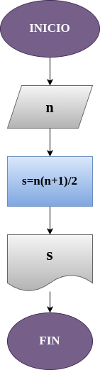

# Suma_n_Numeros
Suma de los n primeros números naturales 

# Análisis
## Input
### Variables de entrada
n: valor a ingresar

### Processing
S= suma de los n primeros números naturales

S= (n(n+1))/2 

### Output
S 
# Diseño 

# Construcción